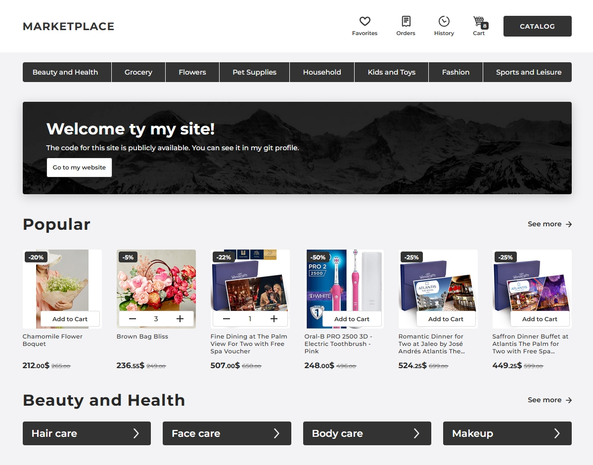

# Маркетплейс swenlii.
🛍️ мини-маркетплейс

 

## ⚡Описание проекта

**Год разработки**: 2025 год

**Стек**: ● Nuxt.js ● Vue.js ● Vuex ● JS ● HTML ● Stylus

Современный функциональный вебсайт, созданный на основе публичного API, отдающего данные для маркетплейса. На сайте можно просмотреть продукты, отсортированные по категориям, добавить понравившийся продукт в корзину, поделиться им или добавить его в избранное. Сайт реализован на Nuxt.js v3  с использованием препроцессора Stylus.

## 💡 Идея проекта

В процессе разработки использовался публичный API с готовыми данными специально для маркетплейса. На сайте есть продавцы, у каждого свои товары. Товары распределены по категориям, их можно добавлять в корзину. В связи с использованием публичного (чужого) API заказывать на этом сайте нельзя. По этой же причине нельзя регистрироваться, но я добавила страницы избранного и заказов, для которых использовала выдуманные данные, помещённые в JSON файл.

## 📝 Требования
- npm v9.2.0
- node >= 20.9.0
- Поддерживает все современные браузеры
- Проект запускался на windows с использованием программы WebStorm v2022.2.2

## 🛠️ Установка

1. `npm install`
2. `npm run dev`
3. В корне проекта должен лежать файл .env с переменными окружения

Сайт будет доступен по http://locahost:3000

Выход из dev-режима - Ctrl/Cmd + C

